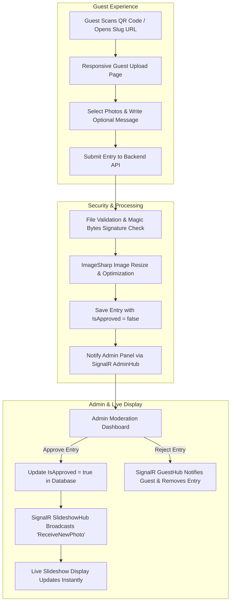
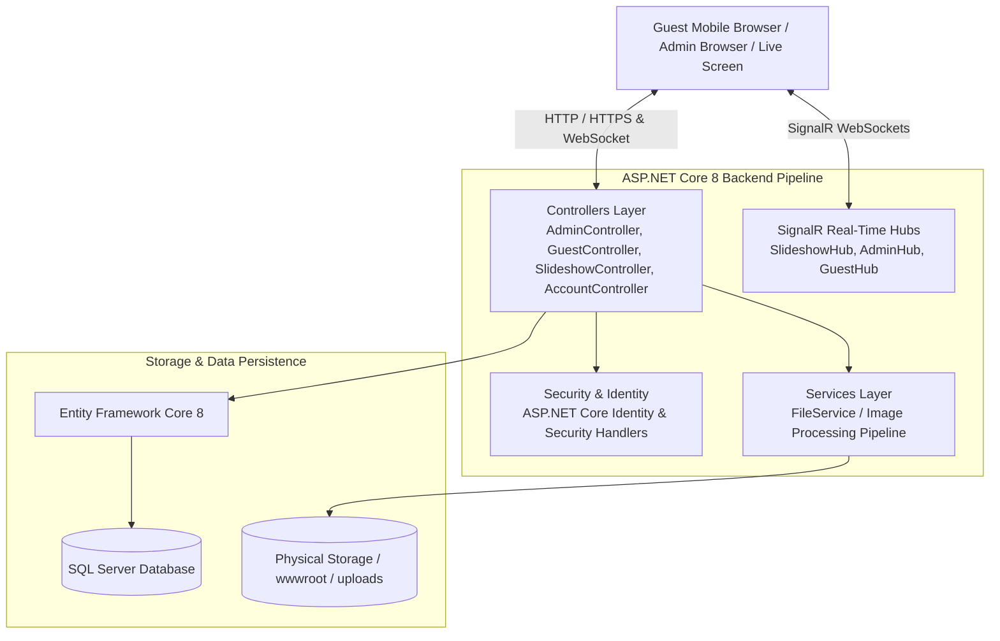
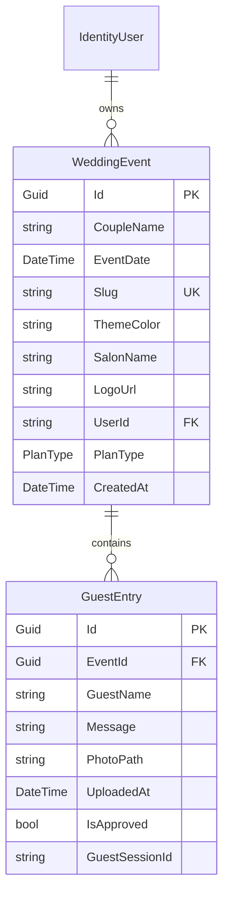
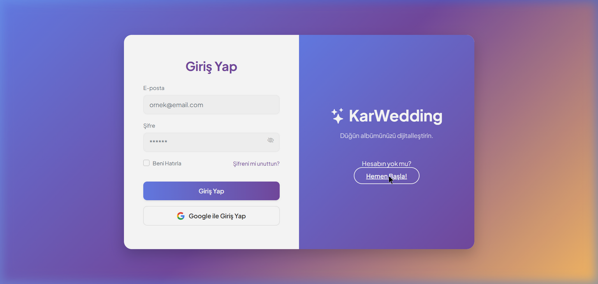
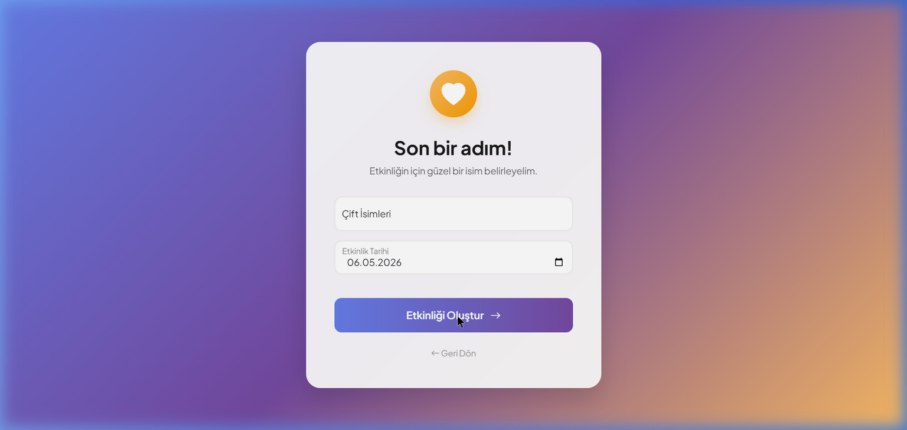
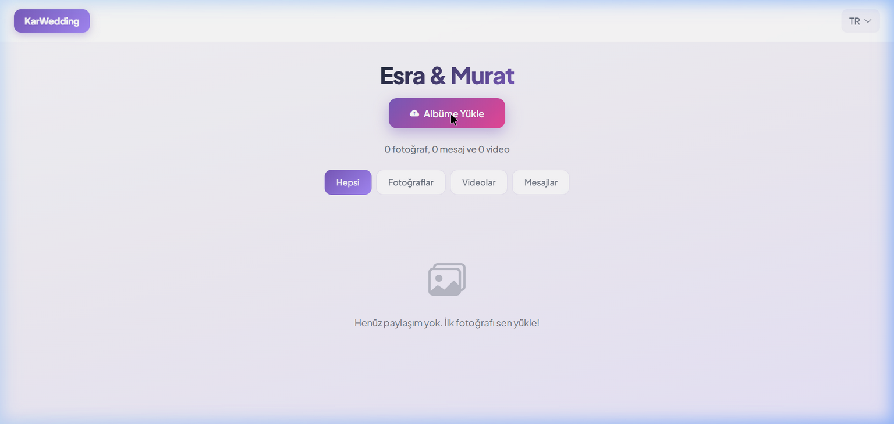
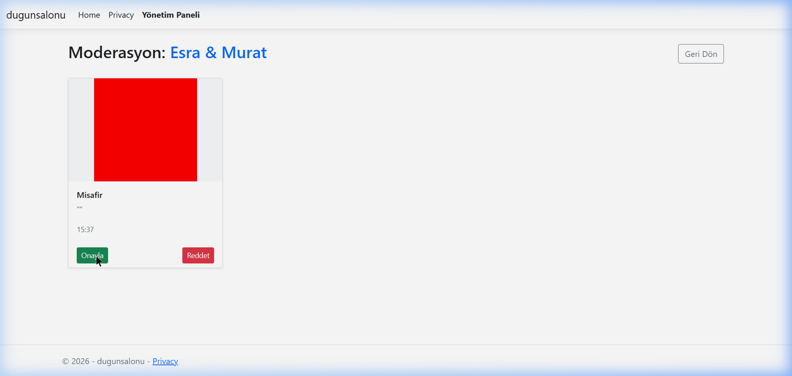
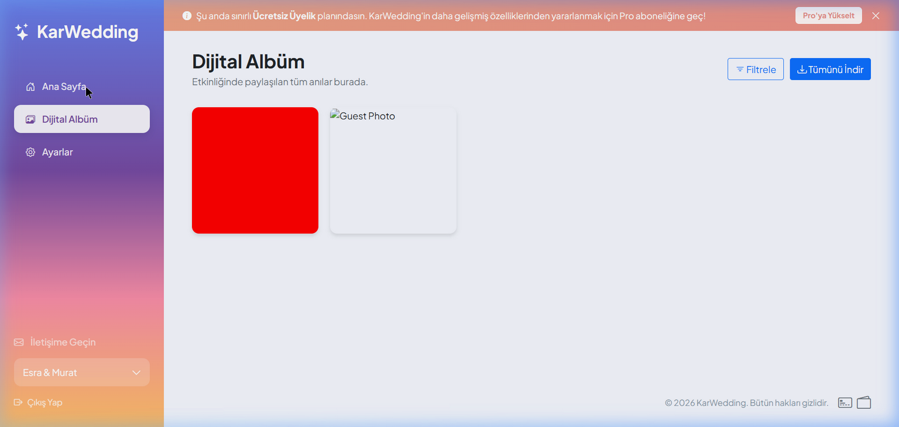

<div align="center">

# 💒 WedSync

**A Real-Time Interactive Event Engagement & Live Media Sharing Platform**

[](https://dotnet.microsoft.com/)
[](https://learn.microsoft.com/en-us/dotnet/csharp/)
[](https://asp.net/)
[]()
[]()
[]()

<p align="center">
  <b>WedSync</b> transforms weddings, galas, and special events by allowing guests to instantly upload photos and messages via QR code without installing any mobile application. Approved guest submissions are broadcasted live to venue displays in real-time via SignalR WebSockets.
</p>

</div>

---

## 📋 Table of Contents

- [Overview](#-overview)
- [How It Works](#-how-it-works)
- [System Architecture](#-system-architecture)
- [Core Features](#-core-features)
- [Real-Time Communication (SignalR)](#-real-time-communication-signalr)
- [Database & Data Model](#-database--data-model)
- [Security & Moderation](#-security--moderation)
- [Technology Stack](#-technology-stack)
- [Project Structure](#-project-structure)
- [Setup & Local Development](#-setup--local-development)
- [Configuration & Environment Variables](#-configuration--environment-variables)
- [Visual Workflow & Screenshots](#-visual-workflow--screenshots)
- [Engineering Highlights](#-engineering-highlights)
- [SaaS & Multi-Tenant Vision](#-saas--multi-tenant-vision)
- [Roadmap](#-roadmap)
- [Project Status](#-project-status)
- [Author & Ownership](#-author--ownership)

---

## 🌐 Overview

### What is WedSync?

**WedSync** is a modern, web-based SaaS platform designed to elevate guest engagement at live events. Traditional event media sharing relies on disposable cameras, manual drive links, or forcing guests to download third-party mobile applications. **WedSync eliminates all friction** by utilizing dynamic QR codes and instant web uploads.

Guests simply scan a venue QR code, open a responsive web application on their mobile browsers, and share photos or personal congratulatory notes. Event hosts and administrators maintain full oversight through a live moderation dashboard, where content can be approved or rejected before being pushed instantly to high-definition venue projection screens and a digital event album.

### Target Audience & Use Cases

- **Weddings & Engagement Parties**: Collect candid moments captured by guests throughout the celebration.
- **Corporate Galas & Product Launches**: Drive attendee participation with real-time feedback and branded display slides.
- **Birthdays & Anniversaries**: Gather sentimental messages and memories from guests in a shared live feed.
- **Venue & Event Hall Operators (B2B)**: Offer a white-labeled value-added service featuring venue branding and logos on event displays.

---

## 🔄 How It Works

### User Workflows



1. **Event Setup**: The host creates an event (e.g., `event/ahmet-ayse`), selects custom theme colors, uploads an optional venue logo, and downloads a generated printable QR invitation card.
2. **Guest Access**: Guests scan the QR code at their tables to access the mobile-friendly upload portal—no user login or app download required.
3. **Media Upload**: Guests upload single or multiple photos and write heartfelt messages. The server sanitizes the uploaded images and holds them in a pending moderation state (`IsApproved = false`).
4. **Real-Time Moderation**: Administrators receive real-time notifications (`AdminHub`) on their moderation dashboard, allowing them to approve or reject submissions individually or in bulk.
5. **Live Broadcasting**: Approved submissions trigger an immediate WebSocket push (`SlideshowHub`), displaying the photo and message seamlessly on the venue's live projection screens.

---

## 🏗️ System Architecture

WedSync is architected as a layered ASP.NET Core 8 Web Application following standard MVC separation of concerns, asynchronous service processing, and real-time WebSocket communication.



### Key Components

- **Presentation Layer**: Built with ASP.NET Core Razor Views, Bootstrap, JavaScript, and Microsoft SignalR client libraries for real-time DOM updates.
- **Controllers Layer**:
  - `AdminController`: Handles event creation, event management, printable QR card generation, ZIP photo archival, and moderation endpoints.
  - `GuestController`: Manages guest-facing digital albums, multi-file uploads, and plan deadline enforcement.
  - `SlideshowController`: Renders full-screen live event slideshow views.
  - `AccountController`: Manages user authentication, registration, password policies, account lockouts, and Google OAuth callbacks.
  - `OnboardingController`: Guides new event hosts through event setup and plan selection.
  - `PaymentController`: Handles plan selection, checkout flow, and subscription-related logic.
- **Services Layer**: `FileService` provides secure file upload handling, extension verification, MIME type enforcement, Magic Bytes signature inspection, path traversal protection, and automated image re-encoding via `SixLabors.ImageSharp`.
- **Real-Time Communication Layer**: Three dedicated SignalR Hubs (`SlideshowHub`, `AdminHub`, `GuestHub`) process group-scoped WebSocket notifications.
- **Persistence Layer**: Entity Framework Core 8 interacting with Microsoft SQL Server to manage `WeddingEvent`, `GuestEntry`, and ASP.NET Core `IdentityUser` tables.

---

## 🌟 Core Features

### 📺 1. Live Event Slideshow
- **Real-Time Updates**: Displays approved photos and guest messages instantly using WebSocket connections (`SlideshowHub`).
- **Smooth Auto-Rotation**: Rotates through event media with subtle crossfade animations every 5 seconds.
- **Dynamic On-Screen QR Code**: Keeps an overlay QR code visible on screen so arriving guests can immediately scan and participate.
- **White-Label Venue Branding**: Displays custom venue logos (`LogoUrl`) on live event displays for business subscribers.

### 📱 2. Frictionless Guest Upload Portal
- **Zero App Download**: Operates entirely within standard mobile web browsers (iOS Safari, Android Chrome).
- **Multi-Photo & Message Upload**: Allows guests to select multiple photos concurrently (`Photos` list) and attach custom notes.
- **Session Tracking**: Tracks guest browser sessions via `GuestSessionId` to deliver real-time feedback (e.g., rejection alerts).

### 🛡️ 3. Admin Moderation Suite
- **Real-Time Pending Counter**: Updates the pending items counter instantly on the admin interface using `AdminHub`.
- **Single & Bulk Moderation**: Approve or reject media individually, or use `ApproveAll` / `RejectAll` for rapid queue management.
- **Digital Photo Gallery**: Dedicated admin gallery view (`Album`) displaying all approved uploads.
- **Event Ownership Enforcer**: Strict authorization checks verify `WeddingEvent.UserId == currentUserId` before any administrative action.

### 🎨 4. Custom Printable QR Invitation Card Generator
- **In-Memory Image Rendering**: Dynamically creates high-resolution printable invitation cards (1200x1600 px) using `QRCoder`, `SixLabors.ImageSharp`, and `SixLabors.Fonts`.
- **Theme Color Integration**: Automatically applies the host's selected event theme color to the card borders, headers, and couple titles.

### 📦 5. One-Click Bulk Media Download (ZIP Archival)
- **Archive Generation**: Packs all approved high-res event photos into a single `.zip` file using .NET's `ZipArchive`.
- **Clean File Naming**: Files inside the ZIP archive are systematically named using the pattern `{GuestName}_{Timestamp}_{OriginalFileName}`.

### 🏢 6. Multi-Tenant B2B White-Labeling & Tiered Subscription Architecture
- **Plan Enforcement (`PlanConfig`)**:
  - **Free Plan**: 50 photo upload limit, 1-day upload window, 7-day album storage.
  - **Pro Plan**: Unlimited photo uploads, 30-day upload window, 365-day storage.
  - **Salon Business (B2B)**: Multi-event management, 365-day storage per event, custom venue logo branding (`LogoUrl`), and priority support.

---

## ⚡ Real-Time Communication (SignalR)

WedSync relies on ASP.NET Core SignalR to enable instantaneous bidirectional communication between client browsers and the backend server without traditional page reloads or polling.

| Hub Name | Route Endpoint | Purpose & Group Scope | Triggered Events |
| :--- | :--- | :--- | :--- |
| **`SlideshowHub`** | `/slideshowHub` | Broadcasts approved content to live event screens joined to the event's `slug` group. | `ReceiveNewPhoto(photoPath, message, guestName)` |
| **`AdminHub`** | `/adminHub` | Sends moderation queue alerts to admins in the `event-{eventId}` group. | `NewPendingItems(pendingCount)` |
| **`GuestHub`** | `/guestHub` | Notifies individual guest sessions in the `guest-{sessionId}` group when an entry is rejected. | `PhotoRejected` |

---

## 🗄️ Database & Data Model

The application utilizes **Entity Framework Core 8** with SQL Server. The core domain entities and their relationships are structured as follows:



### Entity Summary

- **`WeddingEvent`**: Stores event details, couple names, event dates, custom theme hex codes, venue branding metadata (`SalonName`, `LogoUrl`), user ownership (`UserId`), and plan tier (`PlanType`: `Free`, `Plus`, `Pro`, `SalonBusiness`).
- **`GuestEntry`**: Represents photos and messages submitted by guests. Tracks moderation status (`IsApproved`), upload timestamps, file paths, and guest session IDs.
- **`IdentityUser`**: Standard ASP.NET Core Identity entity representing event hosts and venue administrators.

---

## 🔒 Security & Moderation

### 1. Multi-Layer File Upload Security (`FileService`)
To prevent malicious file uploads, executable script injections, and server corruption, `FileService` enforces 6 strict security checks on every upload:

1. **Size Limitation**: Rejects requests exceeding 10MB per file / 15MB total request body.
2. **Extension Whitelist**: Permits only `.jpg`, `.jpeg`, `.png`, `.gif`, and `.webp`.
3. **MIME Type Check**: Validates the incoming header `ContentType`.
4. **Magic Bytes Signature Verification**: Inspects raw binary header bytes (`0xFF 0xD8 0xFF` for JPEG, `0x89 0x50 0x4E 0x47` for PNG, etc.) to detect disguised file extensions.
5. **Path Traversal Sanitization**: Strips dangerous characters (`..`, `/`, `\`) from folder and file paths.
6. **ImageSharp Re-Encoding**: Loads images into `SixLabors.ImageSharp`, resizes images exceeding 1920x1080 resolution, and re-saves them strictly as clean JPEG files, stripping embedded metadata or malicious EXIF payloads.

### 2. Authentication & Authorization Policies
- **Role & User Boundaries**: `[Authorize]` protects administrative controllers. Every administrative operation verifies event ownership (`IsEventOwner`) before allowing edits, moderation, or media downloads.
- **Account Lockout Protection**: ASP.NET Core Identity is configured with brute-force defense (locks account for 15 minutes after 5 consecutive failed attempts).
- **Google OAuth 2.0 Integration**: Configured in `Program.cs` for external social authentication.
- **CSRF Defense**: All POST actions enforce `[ValidateAntiForgeryToken]`.

### 3. Protection of Configuration & Secrets
Sensitive credentials (such as database connection strings and OAuth client secrets) are kept out of source control. Developers should use .NET **User Secrets** (`dotnet user-secrets`) or environment variables for local and production deployment.

---

## 🛠️ Technology Stack

| Category | Technology | Version / Details | Purpose |
| :--- | :--- | :--- | :--- |
| **Framework** | .NET | 8.0 SDK | Core runtime & framework |
| **Backend Framework** | ASP.NET Core | 8.0 MVC | Application structure & HTTP handling |
| **Language** | C# | 12.0 | Primary backend language |
| **Real-Time Communication** | ASP.NET Core SignalR | 8.0 WebSockets | Live data push to displays & admin dashboards |
| **Database ORM** | Entity Framework Core | 8.0.0 | Relational database mapping & migrations |
| **Database Engine** | Microsoft SQL Server | LocalDB / SQL 2022 | Persistent data storage |
| **Authentication** | ASP.NET Core Identity | 8.0.0 | User management, auth, & password policies |
| **OAuth Provider** | Microsoft.AspNetCore.Authentication.Google | 8.0.0 | Social sign-in integration |
| **Image Processing** | SixLabors.ImageSharp | 3.1.12 | Image validation, resizing, & sanitization |
| **Graphics & Drawing** | SixLabors.ImageSharp.Drawing | 2.1.7 | Graphic text rendering for printable cards |
| **QR Code Engine** | QRCoder | 1.8.0 | In-memory QR code vector generation |
| **Frontend UI** | Razor Views / HTML5 / CSS3 | Bootstrap 5 & Custom CSS | Responsive layout & styling |

---

## 📁 Project Structure

```
WedSync/
├── Controllers/
│   ├── AccountController.cs       # Login, Register, Google OAuth, & Lockouts
│   ├── AdminController.cs         # Event management, Moderation, QR Cards, & ZIP Export
│   ├── GuestController.cs         # Guest album view & multi-file photo uploads
│   ├── HomeController.cs          # Public landing page & marketing content
│   ├── OnboardingController.cs    # First-time user setup wizard
│   ├── PaymentController.cs       # Plan selection, checkout flow & subscription logic
│   └── SlideshowController.cs     # Live slideshow full-screen presentation
├── Data/
│   ├── ApplicationDbContext.cs    # EF Core DbContext definition
│   └── DbInitializer.cs           # Database creation & sample seed data
├── Hubs/
│   ├── AdminHub.cs                # SignalR hub for real-time moderation alerts
│   ├── GuestHub.cs                # SignalR hub for guest session feedback
│   └── SlideshowHub.cs            # SignalR hub for live slideshow display updates
├── Migrations/                    # EF Core database migration historical files
├── Models/
│   ├── GuestEntry.cs              # Guest photo/message entity model
│   ├── WeddingEvent.cs            # Event & B2B venue plan model
│   └── ErrorViewModel.cs          # Error view model
├── Properties/
│   └── launchSettings.json        # IIS Express & Kestrel launch profiles
├── Services/
│   ├── FileService.cs             # Magic Bytes validation & ImageSharp sanitization
│   └── IFileService.cs            # File service abstraction interface
├── ViewModels/
│   ├── GuestEntryViewModel.cs     # Photo upload view model
│   ├── LoginViewModel.cs          # Authentication view model
│   ├── PaymentViewModel.cs        # Checkout view model & PlanConfig rules
│   └── RegisterViewModel.cs       # Registration view model
├── Views/
│   ├── Account/                   # Login & Registration Razor views
│   ├── Admin/                     # Dashboard, Moderation, & Album Razor views
│   ├── Guest/                     # Guest Upload & Digital Album Razor views
│   ├── Home/                      # Landing Page Razor view
│   ├── Onboarding/                # Event creation wizard Razor views
│   ├── Payment/                   # Checkout & Success Razor views
│   ├── Shared/                    # Layout templates (_Layout, _LandingLayout)
│   └── Slideshow/                 # Live full-screen slideshow view
├── wwwroot/
│   ├── css/                       # Stylesheets
│   ├── demo/                      # Demonstration assets & step workflow screenshots
│   ├── img/                       # Marketing & graphic images
│   ├── js/                        # JavaScript & SignalR client libraries
│   └── uploads/                   # Uploaded guest photos & logos (git-ignored)
├── Program.cs                     # Application bootstrap, DI container, & middleware
├── dugunsalonu.csproj             # Project file & NuGet dependencies
└── README.md                      # Project documentation
```

---

## 💻 Setup & Local Development

Follow these steps to run WedSync on your local development machine:

### Prerequisites

- [.NET 8.0 SDK](https://dotnet.microsoft.com/download/dotnet/8.0) installed.
- [SQL Server](https://www.microsoft.com/sql-server/) (or SQL Server Express / LocalDB).
- Git installed on your system.

### Installation Steps

1. **Clone the Repository**
   ```bash
   git clone https://github.com/03betulpehlivan/WedSync.git
   cd WedSync
   ```

2. **Restore Dependencies**
   ```bash
   dotnet restore
   ```

3. **Configure Local Application Settings**
   Ensure your database connection string in `appsettings.json` points to your local SQL Server instance:
   ```json
   "ConnectionStrings": {
     "DefaultConnection": "Server=(localdb)\\mssqllocaldb;Database=WedSyncDB;Trusted_Connection=True;MultipleActiveResultSets=true"
   }
   ```

4. **Apply Database Migrations**
   Run EF Core tools to create the database schema:
   ```bash
   dotnet ef database update
   ```

5. **Run the Application**
   ```bash
   dotnet run
   ```
   Open your browser and navigate to `https://localhost:7196` or `http://localhost:5242` (or the port displayed in your console).

---

## 🔒 Configuration & Environment Variables

When configuring WedSync for development or production deployment, keep the following security guidelines in mind:

- **Database Credentials**: Never commit real database passwords or connection strings to source control.
- **OAuth Keys**: If enabling Google Authentication, store `ClientId` and `ClientSecret` using .NET User Secrets:
  ```bash
  dotnet user-secrets set "Authentication:Google:ClientId" "YOUR_GOOGLE_CLIENT_ID"
  dotnet user-secrets set "Authentication:Google:ClientSecret" "YOUR_GOOGLE_CLIENT_SECRET"
  ```
- **Media Uploads**: The directory `wwwroot/uploads/` is dedicated to user-generated images and should be excluded from version control (`.gitignore`).

---

## 🖼️ Visual Workflow & Screenshots

The repository includes visual step-by-step demonstrations showcasing the user and administrative experience:

| Workflow Step | Description | Visual Screenshot |
| :--- | :--- | :--- |
| **1. Registration & Onboarding** | Account setup and plan selection wizard. |  |
| **2. Event Setup** | Configure event details, date, theme colors, and venue logo. |  |
| **3. Guest Photo Upload** | Responsive mobile interface for uploading photos and writing notes. |  |
| **4. Admin Moderation** | Real-time moderation interface with single/bulk approve and reject controls. |  |
| **5. Live Event Display** | Full-screen slideshow broadcasting approved media with dynamic QR code overlay. |  |

---

## 💡 Engineering Highlights

- **Bi-Directional Real-Time Synchronization**: Seamless integration of SignalR WebSockets enables near real-time synchronization between an admin's moderation action and the visual update on venue screens.
- **Defensive Binary Validation**: Implementation of Magic Bytes binary header inspection prevents spoofed image uploads, ensuring high security without sacrificing performance.
- **Dynamic Graphics Processing**: In-memory generation of custom printable QR cards using ImageSharp drawing APIs, rendering custom fonts and theme colors on-the-fly.
- **Architectural Scoping & Security**: Robust entity ownership checking across controllers eliminates IDOR (Insecure Direct Object Reference) vulnerabilities.

---

## 🏢 SaaS-Oriented & Multi-Tenant Design

WedSync is designed with a scalable **Software-as-a-Service (SaaS)** architecture:

- **Tiered Commercial Subscriptions**: Flexible pricing models (`Free`, `Pro`, `SalonBusiness`) allowing event hosts to scale memory storage and upload quotas based on their needs.
- **B2B White-Labeling for Event Venues**: Enables wedding venues and banquet halls to offer branded event media platforms under their own business name and logo (`SalonBusiness` tier).
- **Multi-Event Organization**: Business subscribers can host and manage multiple events simultaneously from a single administrative account.

---

## 🚀 Roadmap

- [ ] **Payment Gateway Integration**: Integration of live payment providers (such as Stripe or Iyzico) to replace the current payment simulation architecture.
- [ ] **AI-Powered Automated Content Moderation**: Machine learning integration (such as Azure AI Content Safety or AWS Rekognition) for automated filtering of inappropriate media.
- [ ] **Progressive Web App (PWA) Support**: Adding offline capabilities and push notifications for guest photo uploads.
- [ ] **Advanced Event Analytics**: Metrics dashboard detailing guest participation rates, total uploads, and peak engagement times.

---

## 📊 Project Status

**WedSync** is a full-stack portfolio application demonstrating real-time interactive media broadcasting, secure image processing, and SaaS-oriented architecture built with ASP.NET Core 8 and C#.
---

## ✍️ Author & Ownership

**Betül Pehlivan**

- **GitHub**: [@03betulpehlivan](https://github.com/03betulpehlivan)
- **Repository**: [https://github.com/03betulpehlivan/WedSync](https://github.com/03betulpehlivan/WedSync)
